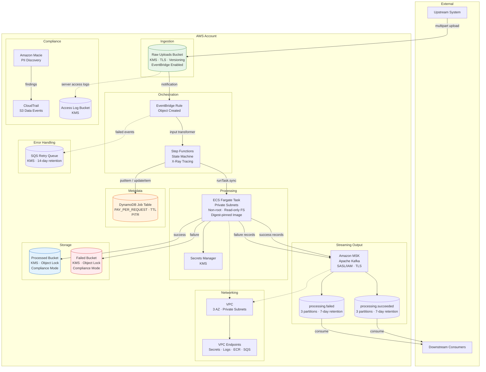
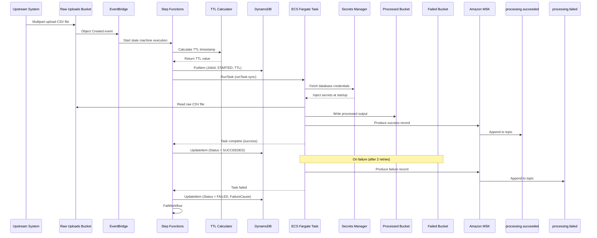

# Data Processing Infrastructure

[](https://github.com/tukue/data-processing-infrastructure/actions/workflows/ci.yml)
[](LICENSE)
[](https://aws.amazon.com/cdk/)
[](https://www.typescriptlang.org/)
[](https://www.openpolicyagent.org/)

## Overview

This platform provides production-grade AWS infrastructure for ingesting, processing, and storing CSV data files through an event-driven pipeline. It solves the problem of reliably moving large CSV files from upload through transformation to durable storage, with full auditability and compliance controls at every stage.

Organizations that ingest bulk data from upstream partners, internal systems, or customer uploads face a recurring challenge: files arrive unpredictably, processing takes minutes rather than milliseconds, failures must not lose data, and sensitive fields must be protected throughout the lifecycle. This platform addresses all four concerns with a single, deployable CDK stack.

**Core capabilities:**

- Event-driven CSV file ingestion and processing via AWS Step Functions and ECS Fargate
- Real-time streaming output to Amazon MSK (Apache Kafka) for downstream consumers
- Per-file job tracking with automatic expiration and status auditing
- Three-tier encryption with customer-managed KMS keys across all data domains
- Policy-as-code enforcement through OPA/Rego in CI, validating every synthesized template against security guardrails
- Configurable data retention, compute sizing, and network topology without source code changes

**Key technologies:** AWS CDK v2 (TypeScript), Amazon S3, AWS Step Functions, Amazon ECS Fargate, Amazon DynamoDB, Amazon EventBridge, Amazon MSK (Apache Kafka), AWS KMS, Amazon Macie, AWS CloudTrail, Open Policy Agent.

---

## Platform Goals

Every architectural decision in this system traces back to a small set of non-functional requirements. These goals are ordered by priority — when trade-offs arise, the higher-priority goal wins.

### 1. Security by Default

Data processed through this pipeline may contain personally identifiable information. The platform cannot assume that uploaders or processors are trustworthy — it must enforce protection mechanically rather than through convention. Encryption, network isolation, least-privilege IAM, and object immutability are not optional additions; they are baseline properties of every resource the stack creates.

### 2. Reliability Without Operational Burden

CSV files can be multi-gigabyte and processing can take 5-10 minutes. A synchronous request/response model is inappropriate for this workload. The platform must survive transient infrastructure failures (ECS task crashes, API throttling, network partitions) without requiring human intervention, while keeping the operational surface small enough for a small team to manage.

### 3. Cost Efficiency at Variable Scale

Data volume is unpredictable. The platform processes zero files on some days and thousands on others. Provisioned capacity that sits idle during quiet periods is wasteful. The design favors pay-per-request and pay-per-use models, and avoids permanently provisioned infrastructure (like NAT gateways) when it is not strictly required.

### 4. Portable Deployment

The same infrastructure definition must deploy to development, staging, and production accounts, and potentially to multiple AWS regions. Configuration — not code changes — should control environment-specific behavior. This eliminates the class of bugs where environment-specific tweaks are applied inconsistently across environments.

### 5. Automated Policy Enforcement

Security reviews and manual checklists do not scale. Every security requirement that can be expressed as a machine-readable rule should be validated automatically on every commit. The platform uses OPA/Rego policies evaluated against the synthesized CloudFormation template, ensuring that infrastructure drift toward insecure configurations is caught before deployment, not after.

### 6. Maintainability

The infrastructure is defined in a single CDK stack with a small number of well-scoped source files. This is intentional. Premature modularization of an 800-line stack would add indirection without reducing complexity. The codebase is organized so that a new engineer can read the entire infrastructure definition in under an hour.

---

## Architecture Overview



### Component Responsibilities

| Component | Purpose | Why This Service |
|---|---|---|
| **S3 (Raw)** | Receives uploaded CSV files. Triggers the processing pipeline via EventBridge notifications. | S3 provides durable, infinitely scalable object storage with native event notifications. Multipart upload support is critical for multi-GB files. |
| **EventBridge** | Routes S3 `Object Created` events to Step Functions. Acts as the decoupling layer between upload and processing. | EventBridge provides content-based filtering, input transformation, built-in retry with retry queues, and no Lambda glue code. |
| **Step Functions** | Orchestrates the end-to-end workflow: TTL calculation, job status tracking, Fargate task execution, success/failure handling. | Step Functions provides visual workflow debugging, native ECS integration (`runTask.sync`), built-in retry/catch, X-Ray tracing, and timeout enforcement — all without custom orchestration code. |
| **ECS Fargate** | Executes the CSV processor container in an isolated, serverless compute environment. | Fargate eliminates EC2 instance management. The processor is a black-box container maintained by a separate team — Fargate runs it without adapting it to Lambda's execution model (handler, ephemeral storage limits, packaging constraints). One-off tasks are the natural fit for episodic workloads. |
| **DynamoDB** | Stores job metadata (status, timestamps, failure cause) with TTL-based automatic cleanup. | DynamoDB provides single-digit-millisecond reads, PAY_PER_REQUEST billing for variable workloads, point-in-time recovery, and TTL for zero-cost cleanup of expired records. |
| **KMS (3 keys)** | Customer-managed encryption keys for storage, operational, and secrets data tiers. | Separate keys per tier limit blast radius. If the storage key is compromised, operational data (logs, metadata) and secrets remain protected. |
| **SQS** | Retry queue for EventBridge invocations that fail to start a state machine execution. | Provides bounded retry with 14-day retention, giving operators time to investigate and replay failed events. |
| **MSK** | Streaming output backbone. Processor writes success/failure records to Kafka topics for downstream consumers. | Provides real-time data streaming with SASL/IAM authentication, TLS encryption, and 7-day message retention. Decouples processing from consumption. |
| **CloudTrail** | Object-level audit trail for all S3 data buckets. | Required for compliance and forensic investigation. Captures who accessed which object, when, and from where. |
| **Macie** | Automated PII discovery across S3 buckets. Routes findings to CloudWatch Logs and SNS. | Provides continuous data security monitoring without custom scanning jobs. Findings are routed to operational alerting. |
| **VPC + Endpoints** | Isolates processing tasks in private subnets. Interface endpoints keep AWS service traffic off the public internet. | Network isolation is a defense-in-depth measure. Even if IAM policies are misconfigured, tasks cannot reach the public internet. |

---

## Design Considerations

This section explains the reasoning behind every major architectural decision. Each entry follows a structured format: the context that motivated the decision, the approach selected, why it was chosen, what benefits it provides, what trade-offs were accepted, and what alternatives were considered.

---

### Event-Driven vs. Synchronous Communication

**Context:** CSV file uploads arrive unpredictably. Processing takes 5-10 minutes. The system must handle bursts without dropping files and without provisioning idle compute.

**Decision:** S3 `Object Created` events flow through EventBridge into Step Functions. The pipeline is fully asynchronous — the uploader does not wait for processing to complete.

**Why:** Synchronous processing would require the uploader to hold a connection open for minutes, retry on failure, and handle partial processing states. Event-driven decoupling means uploaders write to S3 and return immediately. The platform guarantees eventual processing through Step Functions orchestration and SQS retry queues.

**Benefits:**
- Uploaders are decoupled from processing latency and failure modes.
- Burst uploads are absorbed by S3 and EventBridge without backpressure.
- Processing failures are handled independently from uploads.

**Trade-offs:** The uploader cannot receive immediate confirmation that processing succeeded. A separate status query mechanism (DynamoDB job table) is needed for this use case.

**Alternatives considered:**
- *Lambda-based synchronous processing:* Rejected because Lambda allocates CPU proportional to memory — achieving adequate CPU for CSV processing requires 3-10GB memory allocations, which is expensive for CPU-bound work. Additionally, the processor is a black-box container that would need adaptation to Lambda's execution model (handler entry point, ephemeral storage limits, deployment package constraints).
- *SQS direct integration:* EventBridge was chosen over SQS because EventBridge provides content-based filtering, input transformation, and native Step Functions integration — reducing the need for Lambda consumers.

---

### Step Functions vs. Custom Orchestration

**Context:** The workflow involves multiple steps (TTL calculation, job status updates, ECS task execution, success/failure handling) with retry and catch semantics. Building this as a custom Lambda-based orchestrator would require significant code.

**Decision:** Use AWS Step Functions with native ECS `runTask.sync` integration.

**Why:** Step Functions provides the orchestration logic as a managed service. The state machine definition is declarative, auditable, and visually debuggable. The `runTask.sync` integration means Step Functions holds the workflow execution open while waiting for the Fargate task to complete, then applies retry and catch handling automatically.

**Benefits:**
- No custom orchestration Lambda functions to maintain.
- Built-in X-Ray tracing for distributed debugging.
- 30-minute execution timeout prevents runaway workflows.
- Visual execution history in the AWS console for operational debugging.

**Trade-offs:** Step Functions has per-state-transition pricing. For high-volume workloads (thousands of files per hour), this cost becomes significant.

**Alternatives considered:**
- *Lambda-based orchestrator:* Rejected because it requires custom code for retry, catch, timeout, and state tracking — all of which Step Functions provides natively.
- *AWS Batch:* Considered for heavier scheduling needs but adds complexity (job queues, compute environments) that is not justified for this use case.

---

### Fargate for Long-Running Compute

**Context:** CSV processing takes 5-10 minutes. The workload is episodic — files arrive in bursts with quiet periods in between. The processor is a black-box container image maintained by a separate team.

**Decision:** Use ECS Fargate one-off tasks (not a persistent ECS service) launched by Step Functions.

**Why:** Fargate provides serverless container execution without managing EC2 instances. One-off tasks are provisioned on demand and terminate automatically. This matches the episodic workload pattern perfectly — compute costs are zero during quiet periods.

**Benefits:**
- No EC2 instance management, patching, or capacity planning.
- Compute costs are proportional to actual processing, not peak provisioned capacity.
- Container isolation provides security boundaries between processing runs.
- Fargate tasks support private subnet placement with no public IP.

**Trade-offs:** Fargate tasks have a 10-minute vCPU/memory duration limit per task. Very large files that require more processing time would need architectural changes.

**Alternatives considered:**
- *Lambda:* Rejected because Lambda's CPU-to-memory proportionality makes it expensive for CPU-bound CSV processing, its ephemeral storage limits (512MB default) constrain large file handling, and the processor container would need adaptation to Lambda's execution model (handler entry point, packaging constraints).
- *EC2-based ECS service:* Rejected because it requires instance management, auto-scaling configuration, and costs money even when idle.
- *AWS Batch:* A viable alternative for future scaling, but adds operational complexity (job queues, compute environments, scheduling policies) that is not justified at current scale.

---

### Amazon MSK as Streaming Output

**Context:** The processor writes output to S3 for durable storage, but downstream services need real-time access to processed records. S3 is optimized for batch consumption, not streaming.

**Decision:** Add Amazon MSK (Managed Streaming for Apache Kafka) as a streaming output backbone. The processor writes success/failure records to dedicated Kafka topics. Downstream consumers subscribe independently.

**Why:** MSK provides real-time data streaming without modifying the existing S3 pipeline. Kafka's consumer model allows multiple downstream services to subscribe independently, replay messages, and process records at their own pace. SASL/IAM authentication eliminates password management.

**Benefits:**
- **Decoupled consumers** — downstream services subscribe to topics independently
- **Replay capability** — Kafka retains messages for 7 days, enabling reprocessing
- **Real-time access** — consumers get processed records within seconds
- **No pipeline changes** — the existing S3 batch pipeline remains untouched

**Trade-offs:**
- MSK adds ~$245/month baseline cost (3 brokers + storage)
- The processor needs a Kafka producer library in the container image
- Topic configuration is static (CDK-defined) — dynamic topics require application logic

**Alternatives considered:**
- *Kafka Connect S3 sink:* Rejected because it adds latency (polling S3) and complexity (connector management).
- *SQS for streaming:* Rejected because SQS is pull-based, has message limits, and lacks replay capability.
- *Kinesis Data Streams:* Considered, but Kafka provides better ecosystem compatibility and consumer group semantics.

---

### Infrastructure as Code with AWS CDK

**Context:** The infrastructure must be version-controlled, reproducible across environments, and auditable.

**Decision:** Use AWS CDK v2 with TypeScript for infrastructure definition.

**Why:** CDK provides a high-level, typed interface to AWS resources. TypeScript's type system catches configuration errors at synthesis time, before deployment. CDK's construct library encodes AWS best practices (e.g., `BucketEncryption.KMS` instead of manually writing CloudFormation encryption properties).

**Benefits:**
- Synthesized CloudFormation templates are auditable and diffable.
- TypeScript type checking catches misconfigured resource properties at build time.
- CDK Nag integration provides automated security validation during synthesis.
- Context-based configuration enables environment-specific deployments without code changes.

**Trade-offs:** CDK introduces a dependency on the `aws-cdk-lib` package, which is large and updates frequently. CDK v2 breaking changes occasionally require code updates.

**Alternatives considered:**
- *Terraform:* A strong alternative, but CDK was chosen for its tighter integration with AWS services, TypeScript type safety, and the ability to use programming language features (functions, conditionals, loops) directly in the infrastructure definition.
- *CloudFormation YAML:* Rejected because YAML templates become unmanageable at this scale and lack type checking.

---

### Modular Infrastructure Design (Single Stack)

**Context:** The infrastructure contains 14+ AWS services. Should these be split into multiple CDK stacks for independent deployment and review?

**Decision:** A single CDK stack containing all resources, with deployment configuration separated into a dedicated resolver module (`deployment-config.ts`).

**Why:** At this scale, the overhead of cross-stack references, dependency management, and deployment ordering outweighs the benefits of modularization. A single stack means:
- One `cdk deploy` command provisions the entire platform.
- Cross-resource dependencies are resolved automatically by CloudFormation.
- Code review is simpler — the entire infrastructure is in one pull request.

The configuration resolver is separated because it has distinct concerns (input validation, environment variable resolution, CDK context lookup) and benefits from independent testing.

**Benefits:**
- Atomic deployments — all resources succeed or fail together.
- No cross-stack export/import boilerplate.
- Simpler code review and reasoning about resource relationships.

**Trade-offs:** A single stack means a change to one resource triggers a CloudFormation update for the entire stack. For this platform's scale (~30 resources), this is acceptable.

**Alternatives considered:**
- *Multiple stacks:* Rejected because the added complexity of cross-stack references and deployment ordering is not justified for ~30 resources.

---

### Per-Tier KMS Key Architecture

**Context:** Multiple AWS services require encryption. Using a single KMS key for all data creates a single point of compromise — if the key is leaked, all data is exposed.

**Decision:** Three customer-managed KMS keys, each scoped to a data tier:

| Key | Encrypts | Rationale |
|---|---|---|
| `StorageKey` | S3 buckets (raw, processed, failed, access logs) | Data-at-rest encryption for all object storage |
| `OperationalKey` | DynamoDB, SQS, CloudWatch Logs, CloudTrail, SNS | Operational metadata and audit data |
| `SecretsKey` | Secrets Manager (database credentials, API keys) | Credential material requires the highest isolation |

**Why:** Blast radius reduction. Compromising one key does not expose data encrypted by the other keys. Each key has independent rotation, and key deletion is prevented by `RETAIN` removal policy.

**Benefits:**
- Independent key rotation per tier.
- Compartmentalized access — a process that needs S3 access does not implicitly gain access to secrets.
- Compliance auditability — each key's usage can be tracked independently via CloudTrail.

**Trade-offs:** Managing three keys adds operational overhead compared to a single key. The cost difference is negligible.

**Alternatives considered:**
- *Single KMS key:* Rejected because it violates the principle of least privilege and increases blast radius.
- *AWS-managed keys:* Rejected because customer-managed keys provide rotation control, alias-based referencing, and explicit removal policies.

---

### S3 Object Lock in Compliance Mode

**Context:** Processed and failed files may be subject to regulatory retention requirements. Even administrators should not be able to delete these files before the retention period expires.

**Decision:** Enable S3 Object Lock in Compliance mode on the processed and failed buckets.

**Why:** Compliance mode is the strictest Object Lock setting. Once an object is written, it cannot be deleted or overwritten — not even by the root user — until the retention period expires. This is stronger than Governance mode, which allows users with special permissions to bypass retention.

**Benefits:**
- Regulatory compliance for data retention.
- Protection against accidental or malicious deletion.
- WORM (Write Once Read Many) guarantee for audit purposes.

**Trade-offs:** Compliance mode cannot be disabled once enabled on a bucket. Objects cannot be deleted even if they contain errors. The raw bucket intentionally does not use Object Lock because uploaded files may need to be replaced.

**Alternatives considered:**
- *Governance mode:* Rejected because it allows privileged users to bypass retention, which defeats the compliance purpose.
- *No Object Lock:* Rejected because regulatory requirements demand immutability.

---

### Job Metadata with DynamoDB TTL

**Context:** Processing job metadata (status, timestamps, failure cause) is needed for operational visibility but should not accumulate indefinitely.

**Decision:** Store job records in DynamoDB with a TTL attribute (`Ttl`) that auto-expires records after a configurable retention period.

**Why:** DynamoDB TTL is a zero-cost cleanup mechanism. Without TTL, the job table would grow unboundedly, increasing storage costs and making the table harder to query. TTL is configured per-record at write time, so each job's expiration is independent of its creation time.

The job ID is a deterministic composite of bucket name, object key, and S3 sequencer. This means re-uploading the same file (with a new sequencer) creates a new job record rather than overwriting the previous one — providing an audit trail of reprocessing attempts.

**Benefits:**
- Zero-cost automatic cleanup of expired records.
- No scheduled Lambda functions or manual cleanup operations.
- Deterministic job IDs enable idempotent workflow invocations.

**Trade-offs:** TTL deletion is eventual (can take up to 48 hours). Records may persist slightly longer than their configured TTL.

**Alternatives considered:**
- *Manual cleanup via scheduled Lambda:* Rejected because it adds operational overhead and cost for a problem DynamoDB solves natively.
- *No cleanup:* Rejected because unbounded table growth is a cost and performance concern.

---

### Conditional NAT Gateway Deployment

**Context:** NAT Gateways cost approximately $32/month per AZ plus data processing charges. Most deployments do not require outbound internet access from private subnets — AWS service traffic is routed through VPC endpoints.

**Decision:** Deploy a NAT Gateway only when enrichment API CIDRs are configured. Otherwise, zero NAT Gateways are deployed.

**Why:** The vast majority of AWS service traffic (Secrets Manager, CloudWatch Logs, ECR, SQS) is routed through VPC interface endpoints, which do not require a NAT Gateway. Outbound internet access is only needed when the processor calls external enrichment APIs. Making the NAT Gateway conditional saves ~$32/month for deployments that do not need it.

**Benefits:**
- $32+/month cost savings for deployments without enrichment APIs.
- Fewer infrastructure components to manage and monitor.
- No reduction in security posture — VPC endpoints provide the same isolation.

**Trade-offs:** Deployments with enrichment API CIDRs require a NAT Gateway, adding cost and complexity.

**Alternatives considered:**
- *Always deploy NAT Gateway:* Rejected because it wastes money for deployments that do not need external API access.
- *VPC endpoints for all services:* Not possible for third-party APIs — VPC endpoints only cover AWS services.

---

### Digest-Pinned Container Images

**Context:** Container images tagged with `:latest` or mutable tags can be overwritten silently. A deployment that worked yesterday might pull a different image today, causing unexpected failures or security regressions.

**Decision:** The processor image must be pinned to a SHA-256 digest (`@sha256:<hex>`). Tags like `:latest` are rejected at CDK synthesis time by a regex validation in `deployment-config.ts`.

**Why:** Digest pinning is the only way to guarantee that a deployment uses exactly the image that was tested. Mutable tags create non-deterministic deployments — the same tag can resolve to different images over time. This is a supply chain security requirement.

**Benefits:**
- Reproducible deployments — the same digest always resolves to the same image.
- No silent image drift between deployments.
- CDK synthesis fails fast if an unpinned image is provided.

**Trade-offs:** Updating the processor requires changing the image reference in the deployment configuration, which adds a manual step to the update process.

**Alternatives considered:**
- *Mutable tags with CI/CD verification:* Rejected because tags can be overwritten after verification, and there is no mechanism to guarantee the tag points to the verified image at deployment time.

---

### ECS Secrets Injection vs. Environment Variables

**Context:** The processor needs access to database credentials and API keys. These secrets must not be exposed in environment variables, CloudFormation templates, or ECS task definitions.

**Decision:** Secrets are injected at container startup by the ECS agent using `ecs.Secret.fromSecretsManager()`. The ECS task role has no `secretsmanager:GetValue` permission.

**Why:** ECS Secrets injection means the task role never has permission to read Secrets Manager directly. The ECS agent fetches the secret value at startup and injects it as an environment variable into the container. The container sees the secret as a plain-text environment variable, but the secret value never appears in CloudFormation templates, ECS task definitions, or CloudTrail logs.

**Benefits:**
- Secrets are not stored in the task definition or CloudFormation template.
- The task role cannot independently access Secrets Manager.
- Secret rotation is handled by Secrets Manager without redeploying the task.

**Trade-offs:** Secrets are visible as environment variables inside the running container. A process with access to `/proc/*/environ` could read them.

**Alternatives considered:**
- *Task role with `secretsmanager:GetValue`:* Rejected because it broadens the task role's permissions beyond what is necessary.
- *Environment variables in CloudFormation:* Rejected because secrets would be visible in the template and CloudTrail.

---

### Multipart Upload Support

**Context:** CSV files can be multi-gigabyte. Single PUT operations have a 5GB limit and are susceptible to failure on unreliable networks.

**Decision:** The raw bucket is configured with `abortIncompleteMultipartUploadAfter: 1 day` and lifecycle expiration rules. The platform expects files to arrive via S3 multipart upload.

**Why:** Multipart upload splits large files into parts that can be uploaded independently. If a part fails, only that part needs to be retried — not the entire file. This is critical for multi-GB files on variable networks. The 1-day abort rule cleans up incomplete multipart uploads that were abandoned due to client failures.

**Benefits:**
- Resilient uploads for large files.
- Individual part retries reduce upload time on unreliable networks.
- Automatic cleanup of abandoned uploads prevents storage cost leaks.

**Trade-offs:** Multipart upload initiation and presigned URL generation are not part of this stack — they require an authenticated API, which is outside the current scope.

**Alternatives considered:**
- *Single PUT uploads:* Rejected because of the 5GB limit and lack of resume capability.

---

### Input Transformer for EventBridge Events

**Context:** S3 `Object Created` events contain user identity information and source IP addresses. This metadata is not needed by the processing workflow and should not be passed to Step Functions.

**Decision:** The EventBridge rule uses an input transformer to strip the event down to only `bucket.name`, `object.key`, `object.size`, and `object.sequencer`.

**Why:** Passing unnecessary metadata to Step Functions increases the attack surface — if Step Functions logs are compromised, the logs would contain user identity and IP information. The input transformer acts as a data minimization layer, ensuring the workflow receives only the data it needs.

**Benefits:**
- Reduced attack surface — less data in Step Functions execution history.
- Cleaner workflow input — the state machine does not need to handle irrelevant fields.
- Compliance with data minimization principles.

**Trade-offs:** If future workflow steps need S3 event metadata (e.g., user identity for audit), the input transformer must be updated.

**Alternatives considered:**
- *Passing full events:* Rejected because it violates data minimization principles and increases log exposure.

---

### OPA/Rego Policy-as-Code in CI

**Context:** Security requirements (no wildcard IAM, encryption everywhere, non-root containers) must be enforced on every commit, not just during periodic audits.

**Decision:** OPA/Rego policies validate the synthesized CloudFormation template in the CI pipeline. The CI step runs `opa eval` against the template and counts violations — any violation fails the build.

**Why:** OPA is a general-purpose policy engine that operates on structured data. The synthesized CloudFormation template is structured JSON, making it an ideal input for OPA evaluation. Policies are expressed in Rega, a declarative language that is readable by both engineers and security auditors.

The policies are organized by domain (IAM, S3, network, logging, security, compute, data) across 7 files with 18 rules. This separation makes it easy to find, modify, and audit individual policies.

**Benefits:**
- Security guardrails are enforced before deployment, not after.
- Policies are version-controlled and auditable.
- New security requirements can be added as Rega rules without modifying infrastructure code.
- CDK Nag provides a secondary validation layer.

**Trade-offs:** OPA policies operate on the synthesized template, not the CDK source code. A policy violation might not be caught until synthesis time, which adds a small feedback loop delay.

**Alternatives considered:**
- *CDK Nag only:* Rejected because CDK Nag rules are less configurable and harder to extend than OPA policies.
- *Manual security reviews:* Rejected because they do not scale and are not enforced on every commit.
- *AWS Config rules:* Rejected because they operate on deployed resources, not on templates — violations are caught after deployment, not before.

---

### Portable Configuration Resolution

**Context:** The same stack must deploy to multiple AWS accounts and regions with different configurations (processor image, retention periods, compute sizing).

**Decision:** All configuration is resolved through a priority chain: CDK context (`-c key=value`) > environment variables > hardcoded defaults. The `deployment-config.ts` module handles resolution and validates all inputs.

**Why:** This priority chain supports multiple deployment patterns:
- **Local development:** CDK context values in `cdk.json` or command-line flags.
- **CI/CD pipelines:** Environment variables set by the pipeline.
- **Production:** CDK context values passed explicitly during deployment.

Validation at synthesis time (e.g., rejecting invalid retention values, requiring digest-pinned images) prevents deployment of misconfigured infrastructure.

**Benefits:**
- No code changes needed for environment-specific deployments.
- Validation fails fast at synthesis time, not at deployment time.
- Consistent configuration across development, staging, and production.

**Trade-offs:** The priority chain (context > env > default) is implicit and must be documented. Engineers unfamiliar with the project may be surprised by which value takes precedence.

**Alternatives considered:**
- *Separate CDK apps per environment:* Rejected because it duplicates infrastructure code and increases maintenance burden.
- *Hardcoded values:* Rejected because it requires code changes for each environment.

---

## Data Flow

The complete lifecycle of a CSV file through the platform:



### Stage-by-Stage Breakdown

**1. Ingestion**

Files arrive in the raw S3 bucket via multipart upload. The bucket has EventBridge notifications enabled, so every `Object Created` event is published to the default event bus. The bucket enforces TLS, blocks public access, and encrypts all objects with the storage KMS key.

*Why this design:* S3 is the industry standard for durable object storage. Multipart upload is required for large files (multi-GB CSVs). EventBridge notifications eliminate polling and provide reliable, at-least-once delivery to downstream consumers.

**2. Event Routing**

An EventBridge rule matches `Object Created` events for the raw bucket and routes them to Step Functions. An input transformer strips the event to only the fields needed by the workflow (bucket name, object key, object size, sequencer).

*Why this design:* EventBridge provides content-based filtering, input transformation, built-in retry, and a retry queue — all without Lambda code. The input transformer implements data minimization, reducing the data exposed in Step Functions logs.

**3. Orchestration**

Step Functions executes a four-step workflow:
1. **CalculateTtl** — A Lambda function computes the TTL timestamp for the job record.
2. **InjectDetail** — A Pass state normalizes the event structure.
3. **MarkJobStarted** — A DynamoDB PutItem writes the job record with status STARTED.
4. **RunCsvProcessorTask** — ECS Fargate task runs synchronously.

On success, the job status is updated to SUCCEEDED. On failure (after 2 retries with exponential backoff), the status is updated to FAILED with the error cause.

*Why this design:* Step Functions provides declarative orchestration with built-in retry, catch, timeout (30 minutes), and X-Ray tracing. The native `ecs:runTask.sync` integration means Step Functions holds the execution open until the task completes, eliminating the need for polling or callback mechanisms.

**4. Processing**

The Fargate task reads the CSV file from the raw bucket, processes it, and writes output to either the processed bucket (success) or the failed bucket (failure). Additionally, the processor writes records to Amazon MSK topics for real-time downstream consumption. Secrets are injected at container startup by the ECS agent.

*Why this design:* Fargate provides serverless container execution — no EC2 instances to manage. The processor is a black-box container maintained by a separate team. This separation of concerns means the infrastructure team does not need to understand CSV parsing logic, and the processor team does not need to understand infrastructure. MSK provides real-time streaming output without modifying the existing S3 batch pipeline.

**5. Storage**

Three S3 buckets store data at different stages:
- **Raw:** Upload staging area. Lifecycle expiration (configurable, default 7 days) prevents accumulation.
- **Processed:** Final output. Object Lock in Compliance mode provides WORM protection.
- **Failed:** Processing failures. Object Lock in Compliance mode preserves failures for investigation.

All buckets use customer-managed KMS encryption, versioning, and server access logging to a dedicated access log bucket.

*Why this design:* Separate buckets enable independent lifecycle policies and access controls. Object Lock on processed/failed buckets prevents accidental or malicious deletion during the retention period. The access log bucket provides a complete audit trail of object-level operations.

**6. Monitoring**

- Step Functions execution logs and X-Ray traces provide workflow visibility.
- CloudTrail captures S3 data events for all three data buckets.
- Macie monitors for PII and routes findings to CloudWatch Logs and SNS.
- The DynamoDB job table provides per-file processing status.

*Why this design:* Monitoring is layered — CloudWatch for operational metrics, CloudTrail for audit, Macie for data security, and DynamoDB for business-level status. Each layer serves a different audience (operators, auditors, security teams).

**7. Streaming Output**

Records are published to MSK topics in real-time. Success records go to `processing.succeeded`, failure records go to `processing.failed`. Downstream consumers subscribe independently and process at their own pace.

*Why this design:* MSK decouples processing from consumption. Multiple downstream services can subscribe to the same topics without affecting the processor. Kafka's 7-day retention enables replay and reprocessing without re-uploading files.

---

## Scalability

### Horizontal Scaling

The platform scales horizontally by design. S3 handles millions of concurrent uploads. EventBridge routes events to Step Functions without backpressure. Step Functions creates a new execution for each uploaded file, and each execution launches an independent Fargate task.

**Current limits and scaling paths:**
- **EventBridge:** 10,000 events/second default. Sufficient for most workloads; can be increased via AWS support.
- **Step Functions:** 25,000 concurrent executions. Can be increased via AWS support.
- **Fargate:** 1,000 concurrent tasks per region (default). Can be increased via AWS support.
- **DynamoDB:** PAY_PER_REQUEST mode scales automatically to thousands of reads/writes per second.
- **MSK:** 3 brokers with configurable instance types. Scale by increasing broker count (must be multiple of 3) or upgrading instance type. Auto-scaling can be added for storage.

### Parallel Workloads

Each uploaded file is processed independently. Multiple files uploaded simultaneously trigger parallel Step Functions executions, each launching its own Fargate task. There is no shared state between processing runs — the only shared resource is the DynamoDB job table, which handles concurrent writes via DynamoDB's internal scaling.

### Large Datasets

Multipart upload support enables reliable upload of multi-gigabyte CSV files. The Fargate task's CPU and memory are configurable (default: 1024 CPU units, 2048 MiB memory) to match the processing workload. For very large files, increase the compute allocation:

```bash
cdk deploy -c processorCpu=2048 -c processorMemory=8192
```

### Autoscaling

The platform autoscales implicitly:
- **S3:** Automatically scales to handle any volume of objects.
- **DynamoDB:** PAY_PER_REQUEST mode scales capacity automatically.
- **Step Functions:** Creates executions on demand.
- **ECS Fargate:** Provisions tasks on demand, terminates when complete.

There is no explicit autoscaling configuration because the serverless components handle scaling internally.

### Future Expansion

For significantly higher throughput (hundreds of concurrent large files), consider:
- Adding SQS buffering between EventBridge and Step Functions for burst absorption.
- Implementing reserved concurrency limits on Step Functions to prevent downstream resource exhaustion.
- Evaluating AWS Batch for workloads that require sophisticated scheduling, priorities, or fair-share scheduling.

---

## Reliability

### Retry Mechanisms

**Step Functions retry:** The ECS task step is configured with retry logic:
- **Errors retried:** `ECS.AmazonECSException`, `ECS.ServiceException`, `States.TaskFailed`
- **Max attempts:** 2 retries (3 total attempts)
- **Backoff:** Exponential, starting at 30 seconds with a backoff rate of 2

**EventBridge retry:** Failed state machine invocations are retried up to 3 times with a maximum event age of 2 hours. Failed invocations after all retries are sent to the SQS retry queue.

### Dead Letter Queues

The SQS `RetryQueue` serves as a retry queue for EventBridge invocations that fail to start a state machine execution. The queue has:
- 14-day retention period (gives operators time to investigate)
- KMS encryption
- SSL enforcement

### Idempotent Processing

The job ID is a deterministic composite of bucket name, object key, and S3 sequencer. This means:
- Re-uploading the same file (with a new sequencer) creates a new job record — providing an audit trail.
- If Step Functions delivers the same event twice (at-least-once delivery), the DynamoDB PutItem is idempotent for the same job ID.

### Failure Isolation

- **Task failures** are caught by Step Functions and recorded in DynamoDB before the workflow fails.
- **Orchestration failures** (Step Functions errors) are logged to CloudWatch with X-Ray traces.
- **Event delivery failures** are captured by the SQS retry queue.
- **Processing failures** result in output being written to the failed bucket, preserving the artifact for investigation.

### Health Checks

Step Functions provides built-in execution monitoring. The state machine has a 30-minute timeout to prevent runaway executions. ECS Fargate tasks are monitored by the ECS service scheduler — if a task crashes, Step Functions receives the failure and applies retry logic.

### High Availability

- **S3:** 99.999999999% durability, cross-region replication can be added.
- **DynamoDB:** Point-in-time recovery is enabled. PAY_PER_REQUEST mode runs across multiple AZs.
- **Step Functions:** Managed service with built-in HA across AZs.
- **ECS Fargate:** Tasks run across private subnets in 3 AZs.
- **VPC:** 3 AZ deployment with public and private subnets.

### Disaster Recovery

- **DynamoDB:** Point-in-time recovery enables restore to any point in the last 35 days.
- **S3:** Versioning is enabled on all buckets. Object Lock provides immutability. Cross-region replication can be added for DR.
- **CloudTrail:** Logs are stored in a dedicated, encrypted CloudWatch log group for audit and recovery.
- **Infrastructure:** The CDK stack can be redeployed to a different account or region using the same code with different configuration.

### Backup Strategy

- **DynamoDB:** Automated backups via point-in-time recovery.
- **S3:** Versioning provides point-in-time object recovery. Lifecycle policies control retention.
- **Secrets:** Secrets Manager handles automatic rotation and versioning.
- **Infrastructure:** The CDK source code in Git is the backup for infrastructure definitions.

---

## Security

### Authentication

- **AWS IAM:** All AWS API calls are authenticated via IAM. The Step Functions execution role, ECS task role, and ECS execution role each have scoped permissions.
- **No public APIs:** The platform does not expose any public REST APIs. All access is through AWS service integrations.

### Authorization

- **Least-privilege task role:** The ECS task role can read from the raw bucket and write to the processed and failed buckets. It has no access to DynamoDB, Secrets Manager, or any other service.
- **Scoped execution roles:** The Step Functions execution role can write to DynamoDB, write to CloudWatch Logs, and call ECS. It cannot access S3 or Secrets Manager.
- **Bucket policy Deny rules:** Explicit Deny policies on each data bucket restrict access to only the ECS task role, even if other IAM policies grant broader access.

### IAM

- No wildcard IAM actions in any policy.
- No `AdministratorAccess` managed policies.
- No wildcard assume-role principals.
- Resource-scoped grants through CDK `grantRead()`, `grantWrite()` methods.

### Encryption

| Data Tier | KMS Key | Services |
|---|---|---|
| Storage | `alias/data-processing-storage` | S3 (all buckets) |
| Operational | `alias/data-processing-operational` | DynamoDB, SQS, CloudWatch Logs, CloudTrail, SNS |
| Secrets | `alias/data-processing-secrets` | Secrets Manager |

All keys have automatic rotation enabled and `RETAIN` removal policy (prevents accidental deletion).

### Secrets Management

- Database credentials and API keys are stored in Secrets Manager, encrypted with the secrets KMS key.
- Secrets are injected into containers at startup by the ECS agent — they never appear in task definitions or CloudFormation templates.
- The ECS task role has no `secretsmanager:GetValue` permission.

### Network Segmentation

- **Private subnets:** Fargate tasks run in private subnets with no public IP.
- **VPC endpoints:** Secrets Manager, CloudWatch Logs, ECR, and SQS traffic stays within the AWS network via interface endpoints.
- **Security groups:** The task security group allows only DNS (UDP/TCP 53) and HTTPS (TCP 443) to the VPC CIDR and configured enrichment API CIDRs. No public egress.
- **HTTPS enforcement:** All S3 buckets enforce SSL. The SQS queue enforces SSL.

### Audit Logging

- **CloudTrail:** S3 data events for all three data buckets (raw, processed, failed) at the object level.
- **S3 server access logs:** All data buckets log access to a dedicated access log bucket.
- **Step Functions:** Execution logs at ALL level with X-Ray tracing.
- **Macie:** PII discovery findings routed to CloudWatch Logs and SNS.

### Container Hardening

- Non-root user (UID 65534)
- Read-only root filesystem
- Digest-pinned images (no mutable tags)
- No privileged mode

### MSK Security

- **SASL/IAM authentication** — uses AWS IAM roles, no password management
- **TLS encryption** — all client-broker and inter-broker communication encrypted
- **Encryption at rest** — dedicated KMS key for broker volumes
- **Unauthenticated access disabled** — no anonymous connections allowed
- **Security group isolation** — brokers accessible only from task security group on port 9098
- **Broker logs** — CloudWatch Logs for operational monitoring and audit

---

## Observability

### Logging

| Log Source | Destination | Purpose |
|---|---|---|
| ECS processor containers | CloudWatch Logs (encrypted) | Application-level processing logs |
| Step Functions executions | CloudWatch Logs (encrypted) | Orchestration state transitions and errors |
| CloudTrail S3 data events | CloudWatch Logs (encrypted) | Object-level audit trail |
| Macie findings | CloudWatch Logs + SNS | PII and data security alerts |
| MSK broker logs | CloudWatch Logs (encrypted) | Kafka cluster health and operations |

All log groups are encrypted with the operational KMS key and have configurable retention (default: 30 days).

### Metrics

- **Step Functions:** Execution count, success/failure rate, duration, throttles.
- **DynamoDB:** Read/write capacity consumed, throttled requests.
- **ECS:** CPU/memory utilization, task count, running tasks.
- **S3:** Bucket size, number of objects, request metrics.
- **SQS:** Message count, age of oldest message, retry queue depth.

### Distributed Tracing

Step Functions X-Ray tracing is enabled. Every state machine execution generates a trace that covers:
- Lambda invocation (TTL calculation)
- DynamoDB writes (job status updates)
- ECS task execution (the longest segment)

This provides end-to-end visibility into the processing pipeline's performance.

### Alerting

- **Macie findings:** Routed to an SNS topic for operational alerting. The SNS topic can be subscribed to Slack, PagerDuty, or email.
- **Step Functions failures:** Failed executions can be monitored via CloudWatch Alarms on the `ExecutionsFailed` metric.
- **SQS retry queue depth:** A non-zero retry queue depth indicates events that failed to start state machine executions.

### Operational Health Monitoring

The DynamoDB job table provides a real-time view of processing status:
- `STARTED` — File is being processed.
- `SUCCEEDED` — Processing completed successfully.
- `FAILED` — Processing failed (with `FailureCause` field for debugging).

Records auto-expire via TTL after the configured retention period.

---

## Repository Organization

```
├── .github/
│   ├── workflows/ci.yml              # CI pipeline: build, test, synth, OPA validate
│   └── PULL_REQUEST_TEMPLATE.md       # PR checklist for contributors
├── bin/
│   └── data-processing-infrastructure.ts  # CDK app entry point (16 lines)
├── lib/
│   ├── data-processing-infrastructure-stack.ts  # Core stack definition (786 lines)
│   └── deployment-config.ts          # Configuration resolver with validation (132 lines)
├── policy/                           # OPA/Rego policy-as-code (7 files, 18 rules)
│   ├── iam.rego                      # IAM least-privilege enforcement
│   ├── s3.rego                       # S3 encryption, public access, versioning
│   ├── network.rego                  # Security group ingress/egress rules
│   ├── logging.rego                  # Log retention, CloudTrail configuration
│   ├── security.rego                 # KMS rotation, secrets encryption, container hardening
│   ├── compute.rego                  # ECS task definition requirements
│   └── data.rego                     # DynamoDB PITR, SQS encryption, CloudTrail logging
├── test/
│   └── data-processing-infrastructure.test.ts  # Jest test suite (31 tests, 640 lines)
├── cdk.json                          # CDK configuration and feature flags
├── package.json                      # NPM dependencies and scripts
├── tsconfig.json                     # TypeScript compiler configuration
├── jest.config.js                    # Jest test configuration
├── CONTRIBUTING.md                   # Contributor guidelines
└── LICENSE                           # MIT License
```

**Why this organization:**
- `lib/` contains exactly two files: the stack definition and the configuration resolver. This keeps the infrastructure codebase small enough to read in a single sitting.
- `policy/` is organized by security domain, making it easy to find and modify policies for specific concerns.
- `test/` mirrors `lib/` structure. Tests validate the synthesized CloudFormation template, not CDK constructs — this ensures tests catch issues that would appear in deployment.
- `bin/` is minimal — the entry point delegates configuration resolution to `lib/deployment-config.ts`.

---

## Deployment

### Prerequisites

- AWS CLI configured with target account credentials
- Node.js 22+
- CDK bootstrap completed in the target account/region

### Initial Deployment

```bash
npm install
aws configure
cdk bootstrap aws://<account-id>/<region>
npm run build
cdk deploy -c processorImage=<account-id>.dkr.ecr.<region>.amazonaws.com/csv-processor@sha256:<hex>
```

### Environment-Specific Deployment

The stack is portable across accounts and regions. Configuration is applied through CDK context or environment variables — no code changes required.

```bash
# Production deployment with custom retention and compute
cdk deploy \
  -c processorImage=<account-id>.dkr.ecr.<region>.amazonaws.com/csv-processor@sha256:<hex> \
  -c rawFileRetentionDays=14 \
  -c processedFileRetentionDays=90 \
  -c failedFileRetentionDays=30 \
  -c processorCpu=2048 \
  -c processorMemory=8192 \
  -c jobRetentionDays=60 \
  -c logRetentionDays=90
```

```bash
# Development deployment with enrichment APIs
cdk deploy \
  -c processorImage=<account-id>.dkr.ecr.<region>.amazonaws.com/csv-processor@sha256:<hex> \
  -c enrichmentApiCidrs=203.0.113.0/24,198.51.100.0/24
```

### Configuration Options

All configuration is available through CDK context (`-c key=value`) or environment variables. CDK context takes precedence over environment variables.

| Option | CDK Context | Environment Variable | Default | Description |
|---|---|---|---|---|
| Processor image | `processorImage` | `PROCESSOR_IMAGE` | **Required** | Digest-pinned container image URI |
| Raw file retention | `rawFileRetentionDays` | `RAW_FILE_RETENTION_DAYS` | 7 | Days before raw uploads expire |
| Processed file retention | `processedFileRetentionDays` | `PROCESSED_FILE_RETENTION_DAYS` | 7 | Days before processed files expire |
| Failed file retention | `failedFileRetentionDays` | `FAILED_FILE_RETENTION_DAYS` | 7 | Days before failed files expire |
| Enrichment API CIDRs | `enrichmentApiCidrs` | `ENRICHMENT_API_CIDRS` | (none) | CIDRs for external API access (enables NAT Gateway) |
| Job retention | `jobRetentionDays` | `JOB_RETENTION_DAYS` | 30 | Days before DynamoDB job records expire |
| Processor CPU | `processorCpu` | `PROCESSOR_CPU` | 1024 | Fargate CPU units (256 increments) |
| Processor memory | `processorMemory` | `PROCESSOR_MEMORY` | 2048 | Fargate memory in MiB (512 increments) |
| Log retention | `logRetentionDays` | `LOG_RETENTION_DAYS` | 30 | CloudWatch Logs retention in days |
| MSK cluster name | `mskClusterName` | `MSK_CLUSTER_NAME` | data-processing-streaming | MSK cluster identifier |
| MSK instance type | `mskInstanceType` | `MSK_INSTANCE_TYPE` | kafka.m5.large | Broker instance type |
| MSK broker nodes | `mskNumberOfBrokerNodes` | `MSK_NUMBER_OF_BROKER_NODES` | 3 | Number of broker nodes (must be multiple of 3) |
| MSK Kafka version | `mskKafkaVersion` | `MSK_KAFKA_VERSION` | 3.6.1 | Apache Kafka version |
| MSK EBS volume size | `mskEBSVolumeSize` | `MSK_EBS_VOLUME_SIZE` | 100 | GB per broker (1-16384) |
| MSK success topic | `mskSuccessTopic` | `MSK_SUCCESS_TOPIC` | processing.succeeded | Topic for successful processing records |
| MSK failure topic | `mskFailureTopic` | `MSK_FAILURE_TOPIC` | processing.failed | Topic for failed processing records |
| MSK retention hours | `mskRetentionHours` | `MSK_RETENTION_HOURS` | 168 | Message retention in hours (7 days) |

### CI/CD Pipeline

GitHub Actions runs a validation pipeline on every pull request and push to `main`:

1. **Install dependencies** — `npm ci`
2. **Build** — TypeScript compilation
3. **Test** — Jest test suite (31 tests, sequential execution)
4. **CDK synth** — Synthesize CloudFormation template
5. **OPA policy check** — Validate template against 18 security rules

The pipeline uses minimal permissions (`contents: read` only) and does not deploy. Deployment automation is a planned improvement using GitHub OIDC for credential-free AWS access.

### Rollback Strategy

- **Infrastructure:** `cdk deploy` creates a CloudFormation change set. If the change set fails, the previous stack state is preserved. If the change set succeeds but the new stack is broken, roll back via the CloudFormation console or `aws cloudstack cancel-update-stack`.
- **Processor updates:** Changing the processor image digest triggers an ECS task definition update. New tasks use the new image; running tasks are unaffected.
- **Emergency rollback:** Redeploy the previous commit's infrastructure configuration.

---

## Future Evolution

### Current Limitations

1. **No upload API:** The platform expects files to be placed directly in S3. A production deployment would add an authenticated API (API Gateway + Lambda) for presigned multipart upload URLs.
2. **No real processor:** The stack configures the processor runtime environment but does not include the processor container image itself.
3. **No production alerting:** Macie findings are routed to SNS, but no Slack/PagerDuty/Security Hub integration is configured.
4. **No automated deployment:** The CI pipeline validates but does not deploy. Production deployment requires manual `cdk deploy`.

### Planned Improvements

1. **GitHub OIDC for deployment:** Replace long-lived AWS access keys with GitHub OIDC and short-lived STS credentials for CI/CD deployments.
2. **User-facing job API:** Expose a REST API over the DynamoDB job table for progress tracking and retry visibility.
3. **Operational alerts:** Add CloudWatch Alarms for failed Step Functions executions and SQS retry queue depth.
4. **Custom Macie data identifiers:** Add domain-specific PII detection rules if Macie's managed identifiers are insufficient.
5. **Concurrency controls:** Add reserved concurrency limits or EventBridge/SQS buffering for burst protection.
6. **Integration tests:** Assert IAM policy scope and Step Functions input paths in the test suite.

### Architectural Evolution

As the platform scales, consider these evolution paths:

- **Multi-account deployment:** Separate development, staging, and production AWS accounts with a centralized CI/CD pipeline.
- **AWS Batch migration:** If processing workloads become more complex (priorities, fair-share scheduling, very high concurrency), evaluate migrating from Fargate one-off tasks to AWS Batch.
- **Cross-region replication:** Add S3 cross-region replication for disaster recovery.
- **Data lake integration:** Route processed files to a centralized data lake (S3 + Athena/Glue) for analytical querying.
- **Schema registry:** If CSV formats evolve, add a schema registry to validate file structure before processing.
- **MSK topic expansion:** Add additional topics for different record types (e.g., `processing.warnings`, `processing.metrics`) as downstream consumption patterns mature.
- **MSK Connect:** Add S3 sink connectors to automatically archive processed records to S3, or source connectors to ingest from external Kafka clusters.

---

## License

MIT
