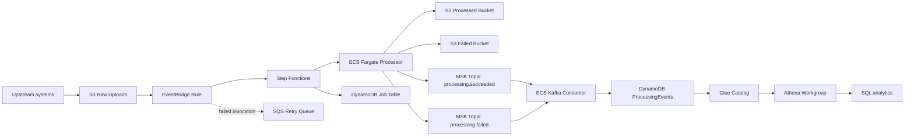

# Data Platform Infrastructure on AWS

[](https://github.com/tukue/data-platform-infrastructure-project2/actions/workflows/ci.yml)
[](LICENSE)
[](https://aws.amazon.com/cdk/)
[](https://www.typescriptlang.org/)
[](https://www.openpolicyagent.org/)

Production-oriented AWS data platform infrastructure for event-driven file ingestion, containerized processing, Kafka streaming, operational event storage, and Athena analytics.

This repository is designed to show how a data platform engineer thinks: business problem first, then reliable data movement, security controls, observable operations, automated policy gates, and a roadmap for production hardening.

## Executive Summary

Many organizations receive bulk CSV files from partners, internal systems, vendors, or customer-facing applications. Those files often arrive unpredictably, contain sensitive data, take minutes to process, and require a reliable audit trail.

This platform solves that problem with a deployable AWS CDK stack that:

- ingests uploaded files through S3 and EventBridge
- orchestrates processing with Step Functions
- runs long-running processing workloads on ECS Fargate
- publishes processing outcomes to Amazon MSK Kafka topics
- persists streaming events into DynamoDB
- exposes operational analytics through Glue and Athena
- enforces security requirements in CI with OPA policy checks

The result is not just a file processor. It is a secure, observable, analytics-ready data platform foundation.

## Who This Is For

**Recruiters and hiring managers:** this project demonstrates practical data platform engineering across AWS, infrastructure as code, streaming, security, CI/CD, and operational analytics.

**Technical managers and senior engineers:** this project demonstrates architecture decisions, failure handling, policy-as-code controls, test coverage, and production tradeoff awareness.

**Platform and data teams:** this is a reference architecture for turning batch file processing into an event-driven data platform with streaming and SQL analytics.

## Business Problem This Repo Solves

Bulk data ingestion creates recurring operational risks:

| Problem | Business Impact | Platform Response |
|---|---|---|
| Files arrive unpredictably | Scheduled batch jobs miss data or create delays | S3 event notifications trigger processing automatically |
| Processing takes minutes | Synchronous APIs time out or become unreliable | Step Functions orchestrates asynchronous processing |
| Failures must not lose data | Missing records break reporting and downstream systems | Kafka offsets commit only after successful event persistence |
| Sensitive files need controls | Compliance and audit exposure | KMS, private networking, IAM, CloudTrail, Macie, Object Lock |
| Teams need visibility | Operators cannot explain what happened | DynamoDB event records and Athena SQL analytics |
| Manual reviews do not scale | Insecure infrastructure can slip into production | OPA evaluates synthesized CloudFormation in CI |

## Platform Story

The original system handled event-driven CSV processing:

```text
CSV upload -> S3 -> EventBridge -> Step Functions -> ECS Fargate -> S3 outputs
```

This data platform work adds the streaming and analytics layer:

```text
ECS processor -> Amazon MSK topics -> Kafka consumer -> DynamoDB -> Glue -> Athena
```

That turns processing outcomes into queryable operational data. Engineers can now answer questions such as:

- How many files succeeded or failed today?
- Which Kafka topic produced the most events?
- Which offsets were consumed?
- What payload was emitted for a failed processing event?
- Are downstream consumers falling behind?

## Architecture



## Implemented Capabilities

### Ingestion and Processing

- S3 raw upload bucket for incoming CSV files
- EventBridge trigger for object-created events
- Step Functions workflow for orchestration, retries, timeout handling, and job status updates
- ECS Fargate task for containerized processing
- Separate S3 buckets for processed and failed outputs
- DynamoDB job table with TTL and point-in-time recovery

### Kafka Streaming Backbone

- Amazon MSK cluster for processing outcome events
- Separate success and failure topics
- TLS in transit and KMS encryption at rest
- SASL/IAM authentication configuration
- Broker logs routed to CloudWatch
- Security group rules for private VPC access

### Kafka Consumer

- ECS Fargate service for consuming Kafka processing events
- Manual offset commit control
- Offset commits happen only after successful handler execution
- Handler failures do not commit offsets, allowing Kafka retry
- DynamoDB throttling handled with bounded exponential backoff
- Processing event records persisted to DynamoDB

### Analytics Layer

- DynamoDB `ProcessingEvents` table for operational events
- Topic and timestamp access pattern for event analytics
- Glue database and table for Athena metadata
- Athena workgroup with encrypted query results
- Versioned Athena results bucket for policy compliance

### Security and Compliance

- Customer-managed KMS keys for storage, operational data, secrets, and MSK
- S3 public access blocked
- S3 SSL enforcement
- S3 Object Lock on processed and failed buckets
- CloudTrail object-level audit logging
- Macie PII discovery
- Private VPC placement for compute
- VPC endpoints for AWS service traffic
- Digest-pinned container images
- Non-root containers with read-only root filesystems
- OPA policy checks for CloudFormation security regressions

## Technical Highlights

### Reliability: Kafka Offset Safety

The consumer disables auto-commit and commits offsets only after the message handler succeeds.

```text
poll Kafka message
write event to DynamoDB
if write succeeds: commit Kafka offset
if write fails: do not commit offset
```

This prevents permanent event loss when DynamoDB writes, parsing, or handler logic fail.

### Reliability: DynamoDB Throttle Handling

DynamoDB throttling uses bounded exponential backoff instead of a single retry.

### Future improvements 

For significantly higher throughput (hundreds of concurrent large files), consider:
- Adding SQS buffering between EventBridge and Step Functions for burst absorption.
- Implementing reserved concurrency limits on Step Functions to prevent downstream resource exhaustion.
- Evaluating AWS Batch for workloads that require sophisticated scheduling, priorities, or fair-share scheduling.

---

## Reliability

### Retry Mechanisms

**Step Functions retry:** The ECS task step is configured with retry logic:
- **Errors retried:** `ECS.AmazonECSException`, `ECS.ServiceException`, `States.TaskFailed`
- **Max attempts:** 2 retries (3 total attempts)
- **Backoff:** Exponential, starting at 30 seconds with a backoff rate of 2

**EventBridge retry:** Failed state machine invocations are retried up to 3 times with a maximum event age of 2 hours. Failed invocations after all retries are sent to the SQS retry queue.

### SQS retry Queues

The SQS `RetryQueue` serves as a retry queue for EventBridge invocations that fail to start a state machine execution. The queue has:
- 14-day retention period (gives operators time to investigate)
- KMS encryption
- SSL enforcement

### Idempotent Processing

The job ID is a deterministic composite of bucket name, object key, and S3 sequencer. This means:
- Re-uploading the same file (with a new sequencer) creates a new job record — providing an audit trail.
- If Step Functions delivers the same event twice (at-least-once delivery), the DynamoDB PutItem is idempotent for the same job ID.

### Failure Isolation

- **Task failures** are caught by Step Functions and recorded in DynamoDB before the workflow fails.
- **Orchestration failures** (Step Functions errors) are logged to CloudWatch with X-Ray traces.
- **Event delivery failures** are captured by the SQS retry queue.
- **Processing failures** result in output being written to the failed bucket, preserving the artifact for investigation.

### Health Checks

Step Functions provides built-in execution monitoring. The state machine has a 30-minute timeout to prevent runaway executions. ECS Fargate tasks are monitored by the ECS service scheduler — if a task crashes, Step Functions receives the failure and applies retry logic.

### High Availability

- **S3:** 99.999999999% durability, cross-region replication can be added.
- **DynamoDB:** Point-in-time recovery is enabled. PAY_PER_REQUEST mode runs across multiple AZs.
- **Step Functions:** Managed service with built-in HA across AZs.
- **ECS Fargate:** Tasks run across private subnets in 3 AZs.
- **VPC:** 3 AZ deployment with public and private subnets.

### Disaster Recovery

- **DynamoDB:** Point-in-time recovery enables restore to any point in the last 35 days.
- **S3:** Versioning is enabled on all buckets. Object Lock provides immutability. Cross-region replication can be added for DR.
- **CloudTrail:** Logs are stored in a dedicated, encrypted CloudWatch log group for audit and recovery.
- **Infrastructure:** The CDK stack can be redeployed to a different account or region using the same code with different configuration.

### Backup Strategy

- **DynamoDB:** Automated backups via point-in-time recovery.
- **S3:** Versioning provides point-in-time object recovery. Lifecycle policies control retention.
- **Secrets:** Secrets Manager handles automatic rotation and versioning.
- **Infrastructure:** The CDK source code in Git is the backup for infrastructure definitions.

---

## Security

### Authentication

If all retries fail, the exception propagates, the Kafka offset is not committed, and the event can be retried.

### CI Quality Gates

Every pull request validates:

- TypeScript compilation
- Jest infrastructure tests
- Python consumer tests
- CDK synthesis
- OPA policy evaluation against synthesized CloudFormation

CI cancels superseded runs for the same branch, has a 20-minute execution
limit, and retains the synthesized CloudFormation template and OPA result for
seven days. This gives reviewers a self-service record of the infrastructure
that was validated. Dependabot also opens weekly pull requests for npm and
Python, and GitHub Actions dependency updates. A separate security workflow
reviews pull-request dependency changes and runs weekly CodeQL analysis across
the TypeScript and Python codebases.

The CI region is configurable through GitHub repository variables:

- `AWS_ACCOUNT_ID`
- `AWS_REGION`

If unset, CI uses a deterministic test account and `eu-west-1`.

## Example Analytics

Count processing events by topic:

```sql
SELECT topic, count(*) AS event_count
FROM processing_events
GROUP BY topic;
```

Inspect recent failed events:

```sql
SELECT *
FROM processing_events
WHERE topic = 'processing.failed'
ORDER BY receivedat DESC;
```

Find event volume over time:

```sql
SELECT
  topic,
  from_unixtime(receivedat) AS received_time,
  count(*) AS events
FROM processing_events
GROUP BY topic, receivedat
ORDER BY received_time DESC;
```

## Design Considerations

### Why EventBridge and Step Functions?

File processing is asynchronous by nature. Uploaders should not wait for a multi-minute processing job. EventBridge decouples upload from orchestration, while Step Functions provides managed retries, catch handling, execution history, and operational visibility.

### Why ECS Fargate?

CSV processing is container-friendly and can exceed the ergonomics of Lambda for CPU, memory, dependency, and runtime control. Fargate provides isolated on-demand compute without managing EC2 instances.

### Why MSK Kafka?

S3 is durable storage, but it is not a real-time event distribution layer. Kafka gives downstream systems independent consumption, replay within retention, and consumer-group semantics.

### Why DynamoDB for Events?

Kafka is a stream, not the long-term operational query store. DynamoDB provides durable event records, predictable lookup patterns, TTL, and a clean bridge into Athena analytics.

### Why Athena and Glue?

Athena lets engineers and analysts query platform events with SQL without building a custom analytics API or dashboard first. Glue provides the catalog metadata Athena needs.

### Why OPA?

Security controls should be automated. OPA checks the synthesized CloudFormation template so insecure changes can be blocked before deployment.

## Production Readiness Signals

This repo intentionally includes platform engineering concerns that are often missing from demo projects:

- Infrastructure as code with AWS CDK
- Unit tests against synthesized infrastructure
- Policy-as-code validation
- Encryption and audit logging
- Private networking
- Manual Kafka offset control
- Backoff handling for throttled writes
- Configurable account, region, retention, compute, and MSK settings
- CI workflow designed for repeatable validation

## Current Limitations

This is a production-oriented reference implementation, not a fully operated production service. Known areas for hardening:

- Python MSK IAM authentication should be validated in a real AWS MSK environment.
- Kafka IAM permissions should be scoped to the correct cluster, topic, and group ARNs.
- Topic creation should eventually move from consumer startup to a dedicated deployment-time provisioner.
- CloudWatch alarms and incident routing should be added for failed workflows, consumer lag, and retry queue depth.
- A presigned upload API would make ingestion safer than direct S3 writes.
- End-to-end integration tests should run against a deployed test environment.

## Repository Layout

```text
.github/workflows/ci.yml                 CI pipeline
bin/data-processing-infrastructure.ts    CDK app entrypoint
lib/deployment-config.ts                 environment and context resolver
lib/data-processing-infrastructure-stack.ts
                                         AWS infrastructure stack
consumer/app.py                          Kafka-to-DynamoDB consumer entrypoint
consumer/kafka_consumer.py               Kafka client and poll loop
consumer/tests/                          Python consumer tests
policy/                                  OPA/Rego security policies
test/                                    Jest CDK infrastructure tests
docker-compose.yml                       local Kafka development support
```

## Deployment

Install dependencies and build:

```bash
npm ci
npm run build
```

Run tests:

```bash
npm test -- --runInBand
PYTHONPATH=consumer python -m pytest consumer/tests
```

Synthesize:

```bash
npx cdk synth --no-notices \
  -c processorImage=<account>.dkr.ecr.<region>.amazonaws.com/csv-processor@sha256:<digest> \
  -c consumerImage=<account>.dkr.ecr.<region>.amazonaws.com/kafka-consumer@sha256:<digest>
```

Deploy:

```bash
npx cdk deploy \
  -c processorImage=<account>.dkr.ecr.<region>.amazonaws.com/csv-processor@sha256:<digest> \
  -c consumerImage=<account>.dkr.ecr.<region>.amazonaws.com/kafka-consumer@sha256:<digest>
```

## Configuration

Configuration is supplied through CDK context or environment variables. CDK context takes precedence.

| Setting | CDK context | Environment variable | Default |
|---|---|---|---|
| Processor image | `processorImage` | `PROCESSOR_IMAGE` | required |
| Consumer image | `consumerImage` | `CONSUMER_IMAGE` | required |
| Raw file retention | `rawFileRetentionDays` | `RAW_FILE_RETENTION_DAYS` | `7` |
| Processed file retention | `processedFileRetentionDays` | `PROCESSED_FILE_RETENTION_DAYS` | `7` |
| Failed file retention | `failedFileRetentionDays` | `FAILED_FILE_RETENTION_DAYS` | `7` |
| Job retention | `jobRetentionDays` | `JOB_RETENTION_DAYS` | `30` |
| Processor CPU | `processorCpu` | `PROCESSOR_CPU` | `1024` |
| Processor memory | `processorMemory` | `PROCESSOR_MEMORY` | `2048` |
| Consumer CPU | `consumerCpu` | `CONSUMER_CPU` | `512` |
| Consumer memory | `consumerMemory` | `CONSUMER_MEMORY` | `1024` |
| Consumer desired count | `consumerDesiredCount` | `CONSUMER_DESIRED_COUNT` | `2` |
| Log retention | `logRetentionDays` | `LOG_RETENTION_DAYS` | `30` |
| MSK broker nodes | `mskNumberOfBrokerNodes` | `MSK_NUMBER_OF_BROKER_NODES` | `3` |
| MSK success topic | `mskSuccessTopic` | `MSK_SUCCESS_TOPIC` | `processing.succeeded` |
| MSK failure topic | `mskFailureTopic` | `MSK_FAILURE_TOPIC` | `processing.failed` |
| MSK consumer group | `mskConsumerGroup` | `MSK_CONSUMER_GROUP` | `data-processing-consumer` |

## Future Improvements

Near-term improvements:

- validate MSK IAM auth end to end in AWS
- scope Kafka IAM resources to exact topic and group ARNs
- move topic creation to deployment-time provisioning
- add CloudWatch alarms for consumer lag and workflow failures
- add an authenticated upload API with presigned multipart upload URLs
- add example Athena dashboards or saved queries

Longer-term platform evolution:

- multi-account dev, staging, and production deployment
- GitHub OIDC-based deployment
- schema validation and data contracts for incoming files
- S3 data lake layout for processed outputs
- MSK Connect for additional sinks and sources
- cross-region disaster recovery for critical buckets

## Portfolio Summary

This project demonstrates practical data platform engineering across:

- AWS infrastructure design
- event-driven architecture
- Kafka streaming integration
- operational analytics
- infrastructure as code
- CI/CD validation
- security and compliance controls
- reliability engineering

It is built to be understandable by non-technical stakeholders, credible to technical managers, and reviewable by senior engineers.

## License

MIT
